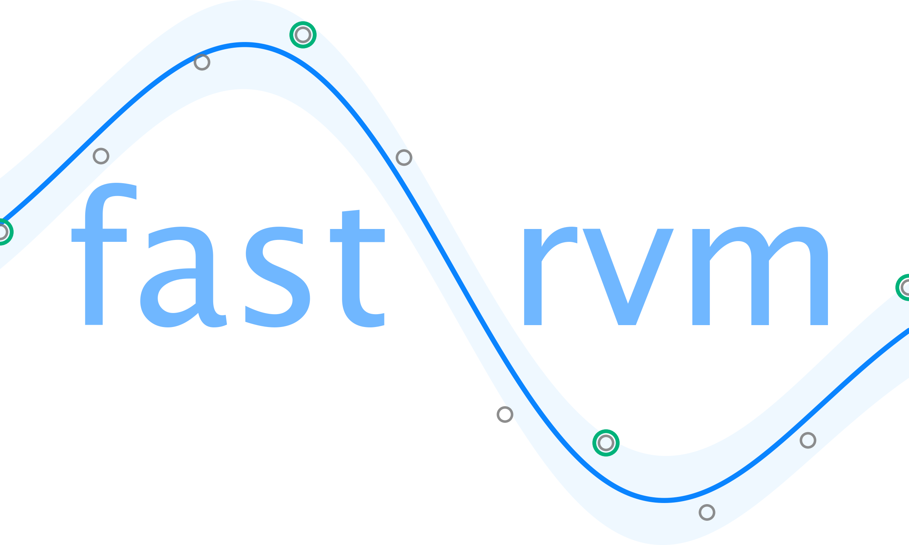

# fastrvm

[](https://github.com/brdav/fastrvm/actions)
[](https://pypi.org/project/fastrvm)
[](https://pypi.org/project/fastrvm)
[](LICENSE)

A fast and clean implementation of the Relevance Vector Machine (RVM).



**fastrvm** implements Tipping's "sparse Bayesian learning" algorithm [2] in a high-performance C++ core and exposes scikit-learn-compatible Python wrappers for:

- RVR — relevance vector regression
- RVC — relevance vector classification

Key benefits

- Fast training and prediction due to the greedy learning algorithm and a tuned C++ linear-algebra core (Armadillo + Einsmallen for optimization).
- Sparse models that automatically select a small set of relevance vectors.
- scikit-learn-compatible Python wrappers: plug into pipelines, grid search, and common tooling.

## Quick Start

Install the latest release from PyPI (wheels are provided for Ubuntu and macOS, Windows requires building from source):

```bash
pip install fastrvm
```

Regression example (RVR):

```python
from fastrvm import RVR
from sklearn.datasets import make_regression
from sklearn.model_selection import train_test_split
from sklearn.metrics import r2_score

X, y = make_regression(n_samples=500, n_features=50, noise=0.1, random_state=0)
X_train, X_test, y_train, y_test = train_test_split(X, y, random_state=0)

model = RVR(kernel='linear', fit_intercept=True, max_iter=2000)
model.fit(X_train, y_train)
print('R2:', r2_score(y_test, model.predict(X_test)))
```

Classification example (RVC)

```python
from fastrvm import RVC
from sklearn.datasets import make_classification
from sklearn.pipeline import make_pipeline
from sklearn.preprocessing import StandardScaler
from sklearn.model_selection import cross_val_score

X, y = make_classification(n_samples=300, n_features=50, n_informative=10, random_state=0)
clf = make_pipeline(StandardScaler(), RVC(kernel='rbf', gamma='scale', n_jobs=-1))
scores = cross_val_score(clf, X, y, cv=5, scoring='accuracy')
print('5-fold accuracy:', scores.mean())
```

Notes on the Python API

- Classes: `RVR` and `RVC` available from `fastrvm`.
- Estimator API: implements scikit-learn conventions (`fit`, `predict`, etc.).
- Kernel options: `rbf`, `linear`, `poly`, `precomputed` (scikit-learn-style names). Various kernel hyperparameters such as `gamma`, `degree`, and `coef0` are supported.
- Multiclass classification: For efficiency reasons `RVC` uses a one-vs-rest classifier for multiclass classification.

See `docs/fastrvm.md` for a short reference doc.

## Installation from Source

For development install from source:

```bash
git clone https://github.com/brdav/fastrvm.git
cd fastrvm
git submodule update --init --recursive
python -m pip install -e '.[dev]'
```

Minimum build dependencies

- CMake >= 3.18
- Python >= 3.9 (development headers)
- C++17-capable compiler (clang, gcc, or MSVC)
- BLAS/LAPACK implementation (OpenBLAS, MKL, or Accelerate)

Note: Builds on Windows are untested in CI. You can attempt a Windows build but expect manual steps.

The C++ core (sparse Bayesian learning algorithm) can also be built independently:

```bash
cmake -S src/cpp -B build/cpp -DCMAKE_BUILD_TYPE=Release
cmake --build build/cpp --target sparsebayes -j
```

## Citation

Key references:

1. Tipping, M. E. (2001). Sparse Bayesian Learning and the Relevance Vector Machine. Journal of Machine Learning Research, 1, 211–244.

2. Tipping, M. E. & Faul, A. C. (2003). Fast Marginal Likelihood Maximisation for Sparse Bayesian Models. Proceedings of the 4th International Workshop on Artificial Intelligence and Statistics (AISTATS / PMLR), pages 276–283, 2003.

This implementation follows the ideas and practical choices from the SparseBayes (v2.0) MATLAB package by Michael Tipping — see the [SparseBayes v2.0 download page](https://www.miketipping.com/downloads.htm). Please cite [1] for the core algorithm and [2] for the marginal-likelihood acceleration where applicable.

## License

MIT — see `LICENSE` for details.

---
Questions, feature requests, or issues? Open an issue on GitHub.
